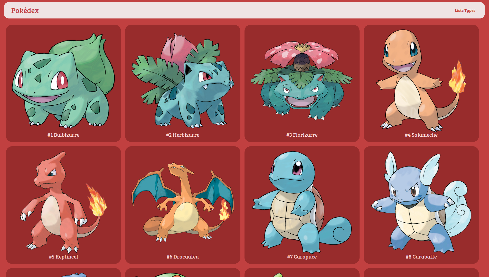

# Pokedex

## Table of contents

* What is Pokedex ?
* How does it work ?
* Stack

### What is Pokedex ?

Pokedex is a school training project to list Pokemons and class them by category.

### How does it work ?

Click on a Pokemon to see its details or check category's type.

Enjoy !

[https://seb-pokedex.herokuapp.com/](https://seb-pokedex.herokuapp.com)

### Stack

